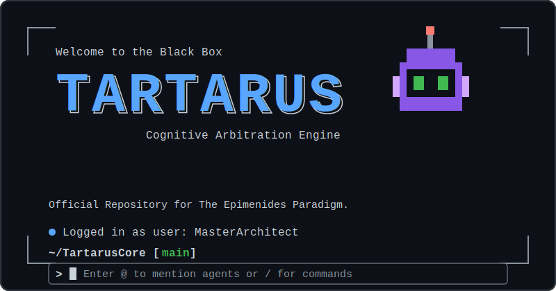

  

# 

## 📂 Repository Contents

This repository contains the foundational elements you need to initiate your rescue sequence:

* `The_Epimenides_Paradigm.pdf`: The official classified directive containing the full lore and the rules.
* `Tartarus_Core.pyc`: The compiled Black Box module. This is your only link to the facility's telemetry streams. Import given compiled file and get the stream using filename.get_telemetry_shards().

---
